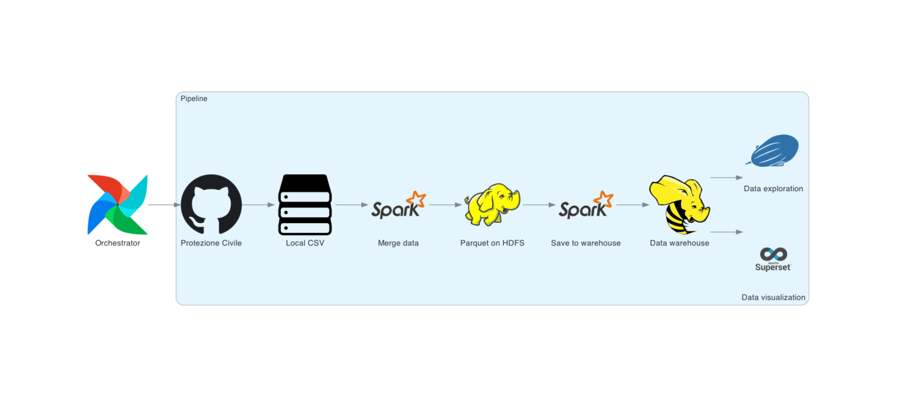

+++
title = "A modern data pipeline using Apache tools - Part 1"
description = "A detailed walkthrough of building a data pipeline using Apache tools, covering the architecture, tools used, and key takeaways from the project."
date = 2023-08-26
[taxonomies]
tags = ["data engineering"]
+++

A few months ago, driven by a desire to enhance my data skills and experiment with new technologies, I've decided to construct a complete data pipeline using exclusively Apache tools. 

Why restrict myself to Apache tools? These tools are widely embraced in the industry, and even when they're not, they still exhibit remarkable stability and seamless integration. Of course, it eventually evolved into a personal challenge of identifying the right Apache tool and successfully implementing it (with the sole exception being Postgres).

The foundation of the pipeline is built within Docker, allowing anyone to easily engage with it by executing the relevant Docker Compose command. Since this marks the project's initial stage, no output is considered finalized yet. For instance, the dashboard isn't intended as the final product; however, the pipeline itself stands solid and functions as expected.

Regarding the dataset, I opted to work with COVID-19 data due to its availability and convenient format. Here's an overview of the pipeline:

## Overview

The process begins with data extraction from the Protezione Civile's GitHub repository, which is the only data source right now but I'm trying to build it with the possibility of expanding it to multiple countries in the future. The data is then cleansed and stored in Parquet within HDFS. Subsequently, it's integrated into a Hive data warehouse, paving the way for visualization and exploration.

Here is a comprehensive list of the tools at play:

- Apache Airflow for orchestration
- Apache Spark for processing
- Apache Hadoop for distributed storage
- Apache Hive for data warehousing
- Apache Superset for data visualization and dashboard creation
- Apache Zeppelin for data exploration and notebook usage

If you'd like to delve deeper into the structure and code, I encourage you to explore the [GitHub repository](https://github.com/davide-andreoli/covid_line).

## Takeaways

While working on the project I've realised a few things that I wanted to share with you.

### Building with Docker

Docker is an exceptional tool, but it presents its unique challenges. A substantial portion of my project time was invested in ensuring the various containers functioned smoothly, first individually and then collectively. The limited and occasionally unclear image documentation complicated matters, especially since it often pertained to unofficial images that had their own peculiarities. Furthermore, to enable consistent viewing, I had to configure persistence for the different containers and establish a method to import data as needed (for instance, with the Superset dashboard). Though I can't claim mastery of Docker, I undeniably expanded my knowledge significantly through this endeavor.

### Operationalizing Systems

While the primary goal isn't to craft a fully production-ready pipeline, operationalizing and synchronizing the systems is imperative to establish a functional pipeline. This task proved intricate, involving ports, environment variables, Python versions, image compatibility, and more. Achieving a functional setup was a complex feat, often requiring fixing one thing while inadvertently breaking another. This process highlighted the immense effort that's often concealed behind cloud and serverless technologies. Although we may not always see it, these operations are fundamental, and confronting them firsthand was incredibly interesting.

### Apache tools

Although they might lack the glamour of cutting-edge innovations and come with supplementary operational intricacies, Apache tools are undeniably robust, well integrated and cater to a wide array of use cases.

### Future steps

The project is currently functional but still in its infancy, so here is a roadmap for things that I've planned:

- Incorporation of Spark MLlib jobs to train machine learning models
- Fine-tuning and enhancing the final products (dashboard and model)
- Adding a different data source (other country)
- Exploration of introducing Apache Atlas for metadata tracking and data governance (potentially)

In conclusion, my journey thus far has been transformative, exposing me to intricate operational aspects and solidifying my appreciation for the reliability of Apache tools. The road ahead promises further growth and refinement of the project.
